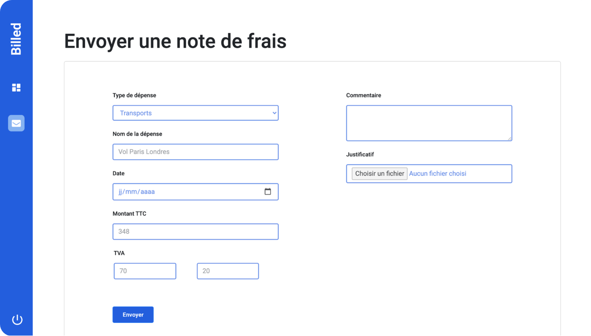

| Choose Your Language | Choisissez Votre Langue |
| -------------------- | ----------------------- |
|   |  |
|[English](#english)      | [Français](#français) |

___

|  | English version |
|:---:|:---:|

<h1 align="center">
    Billed: Debug and Test an HR SaaS Application
</h1>

## Table of Contents
1. [🌟 Introduction](#introduction-en)
2. [📜 Project Context](#context-en)
3. [🚀 Features](#features-en)
4. [💻 Technologies Used](#technologies-en)
5. [🔍 Specifications](#specifications-en)
6. [📦 Provided Elements](#provided-elements-en)
7. [🎓 Affiliation with OpenClassrooms](#openclassrooms-en)
8. [👏 Acknowledgements](#thanks-en)
9. [✍️ Author](#author-en)
10. [©️ License](#license-en)

## 🌟 Introduction 
Welcome to the Billed project, a challenge in debugging and testing for an HR SaaS application. I joined the team to successfully finalize the application following the unexpected departure of a key team member.

## 📜 Project Context 
Billed, a company specializing in SaaS solutions for HR, is in a critical phase of developing its expense report management application. My role is to fix bugs and implement missing tests to ensure the successful launch of this feature.

## 🚀 Features 
- Debugging the web application for both administrator and employee journeys.
- Adding unit and integration tests.
- Developing an End-to-End test plan.

## 💻 Technologies Used 

The development of Billed involved the use of various technologies and tools, essential for ensuring the quality and performance of the application. Here is a detailed overview of these elements:

| Technology | Description |
| ----------- | ----------- |
|  | [**HTML5**](https://developer.mozilla.org/en-US/docs/Web/Guide/HTML/HTML5) for structuring the application's pages. |
|  | [**CSS3**](https://developer.mozilla.org/en-US/docs/Web/CSS) for the design and layout of elements. |
|  | [**JavaScript**](https://developer.mozilla.org/en-US/docs/Web/JavaScript) for feature development, testing, and debugging. |
|  | [**Visual Studio Code**](https://code.visualstudio.com/) used as the primary code editor. |
|  | [**Git**](https://git-scm.com/) for version tracking and management. |
|  | [**GitHub**](https://github.com/) for online code storage and collaboration. |
|  | [**Jest**](https://jestjs.io/en/) for unit and integration testing. |
|  | [**Prettier**](https://prettier.io/) for automatic code formatting. |
|  | [**ESLint**](https://eslint.org/) for static code analysis and quality improvement. |
|  | [**Chrome Debugger**](

https://www.google.com/chrome/) for web application debugging. |

These technologies were carefully selected for their effectiveness and ability to provide a smooth and professional development experience, contributing to the creation of a robust and high-performance application.

## 🔍 Specifications 
- Fixing bugs identified in the [Kanban Notion report](https://www.notion.so/).
- Implementing missing tests for the employee journey.
- Ensuring the stability and reliability of the application.

## 📦 Provided Elements 
- Repositories for the [backend](https://github.com/) and [frontend](https://github.com/).
- Descriptions of features and practical requirements.
- End-to-End test plan for the administrator journey.

## 🎓 Affiliation with OpenClassrooms 
This project was carried out as part of my training with OpenClassrooms, an online educational institution known for its innovative and practical pedagogy. This work exemplifies the application of skills and knowledge acquired during my learning journey.

## 👏 Acknowledgements 
A huge thanks to the Billed team for their trust and support in this crucial project.

## ✍️ Author 
Developed by Mohamed Ali EL HAMECH, a passionate web developer always seeking new challenges.

- 📧 **Email:** [master.code.develop@gmail.com](mailto:master.code.develop@gmail.com)
- 🔗 **LinkedIn:** [Mohamed-Ali EL HAMECH](https://www.linkedin.com/in/master-dev/)
- 💼 **Portfolio:** [www.elhamech-mohamedali.com](https://www.elhamech-mohamedali.com)

## ©️ License 
This project is intended for personal and educational use. All rights reserved.

[Back to Top](#top)

___

|  | Version française |
|:---:|:---:|

<h1 align="center">
    Billed : Débuggez et testez un SaaS RH
</h1>

## Sommaire
1. [🌟 Introduction](#introduction-fr)
2. [📜 Contexte du Projet](#context-fr)
3. [🚀 Fonctionnalités](#features-fr)
4. [💻 Technologies Utilisées](#technologies-fr)
5. [🔍 Cahier des Charges](#specifications-fr)
6. [📦 Éléments fournis](#provided-elements-fr)
7. [🎓 Affiliation à OpenClassrooms](#openclassrooms-fr)
8. [👏 Remerciements](#thanks-fr)
9. [✍️ Auteur](#author-fr)
10. [©️ Licence](#licence-fr)

## 🌟 Introduction 
Bienvenue sur le projet Billed, un défi de débogage et de test pour une application SaaS RH. Je me suis joint à l'équipe pour mener à bien la finalisation de l'application suite au départ inattendu d'un membre clé.

## 📜 Contexte du Projet 
Billed, une société spécialisée dans les solutions SaaS pour les RH, se trouve dans une phase critique de développement de son application de gestion des notes de frais. Mon rôle est de corriger les bugs et d'implémenter les tests manquants pour assurer le lancement réussi de cette fonctionnalité.

## 🚀 Fonctionnalités 
- Débogage de l'application web pour les parcours administrateur et employé.
- Ajout de tests unitaires et d'intégration.
- Rédaction d'un plan de test End-to-End.

## 💻 Technologies Utilisées 

Le développement de Billed a impliqué l'utilisation de diverses technologies et outils, essentiels pour assurer la qualité et la performance de l'application. Voici un aperçu détaillé de ces éléments :

| Technologie | Description |
| ----------- | ----------- |
|  | [**HTML5**](https://developer.mozilla.org/fr/docs/Web/Guide/HTML/HTML5) pour structurer les pages de l'application. |
|  | [**CSS3**](https://developer.mozilla.org/fr/docs/Web/CSS) pour le design et la mise en page des éléments. |
|  | [**JavaScript**](https://developer.mozilla.org/fr/docs/Web/JavaScript) pour le développement des fonctionnalités, les tests et le débogage. |
|  | [**Visual Studio Code**](https://code.visualstudio.com/) utilisé comme éditeur de code principal. |
|  | [**Git**](https://git-scm.com/) pour le suivi des modifications et la gestion des versions. |
|  | [**GitHub**](https://github.com/) pour le stockage et la collaboration sur le code en ligne. |
|  | [**Jest**](https://jestjs.io/fr/) pour les tests unitaires et d'intégration. |
|  | [**Prettier**](https://prettier.io/) pour le formatage automatique du code. |
|  | [**ESLint**](https://eslint.org/) pour l'analyse statique et l'amélioration de la qualité du code. |
|  | [**ESLint**](https://eslint.org/) pour l'analyse statique et l'amélioration de la qualité du code. |
|  | [**Chrome Debugger**](https://www.google.com/chrome/) pour le débogage des applications web. |

_Ces technologies ont été soigneusement sélectionnées pour leur efficacité et leur capacité à offrir une expérience de développement fluide et professionnelle, contribuant ainsi à la réalisation d'une application robuste et performante._

## 🔍 Cahier des Charges 
- Correction des bugs identifiés dans le [rapport de Kanban Notion](https://www.notion.so/).
- Mise en œuvre des tests manquants pour le parcours employé.
- Assurance de la stabilité et de la fiabilité de l'application.

## 📦 Éléments fournis 
- Repositories pour le [backend](https://github.com/) et le [frontend](https://github.com/).
- Description des fonctionnalités et des besoins pratiques.
- Plan de test End-to-End pour le parcours administrateur.

## 🎓 Affiliation à OpenClassrooms 
Ce projet a été réalisé dans le cadre de ma formation avec OpenClassrooms, une institution d'enseignement en ligne reconnue pour sa pédagogie innovante et pratique. Ce travail illustre l'application des compétences et des connaissances acquises au cours de mon parcours d'apprentissage.

## 👏 Remerciements 
Un grand merci à l'équipe Billed pour

 leur confiance et leur soutien dans ce projet crucial.

## ✍️ Auteur 
Développé par Mohamed Ali EL HAMECH, passionné de développement web et toujours en quête de nouveaux défis.

- 📧 **E-mail:** [master.code.develop@gmail.com](mailto:master.code.develop@gmail.com)
- 🔗 **LinkedIn:** [Mohamed-Ali EL HAMECH](https://www.linkedin.com/in/master-dev/)
- 💼 **Portfolio:** [www.elhamech-mohamedali.com](https://www.elhamech-mohamedali.com)

## ©️ Licence 
Ce projet est destiné à un usage personnel et éducatif. Tous droits réservés.

[Retour en haut](#top)