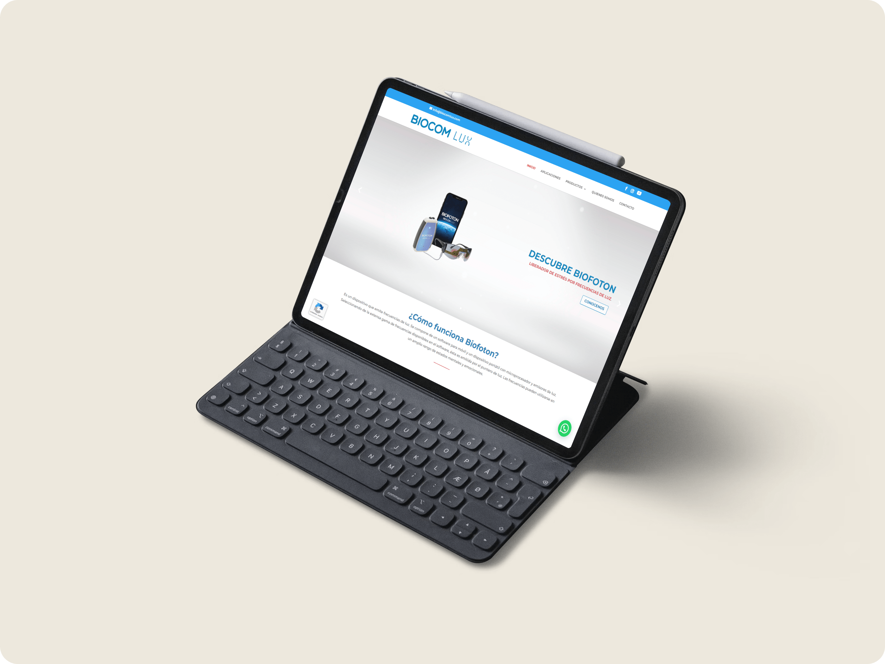

| Choose Your Language | Choisissez Votre Langue |
| -------------------- | ----------------------- |
|   |  |
|[English](#english)      | [Français](#français) |

___

|  | English Version |
|:---:|:---:|

<h1 align="center">
    BiocomLux: Developing an Innovative Health and Wellness Platform
</h1>

## Table of Contents
1. [🌟 Introduction](#introduction-en)
2. [🌍 See the Site in Action](#demo-en)
3. [🔍 Project Overview](#overview-en)
4. [🛠️ Tasks and Achievements](#tasks-en)
5. [💻 Technologies Used](#technologies-en)
6. [📈 Impact and Improvements](#impact-en)
7. [👏 Acknowledgements](#thanks-en)
8. [✍️ Author](#author-en)
9. [©️ License](#licence-en)

## 🌟 Introduction 
Welcome to the BiocomLux project, an initiative dedicated to health and wellness. My role as a Full Stack Developer involved contributing to the development of an advanced technological platform.

## 🌍 See the Site in Action 
Explore the BiocomLux platform in action and discover the enhancements and features developed. Navigate through the site to experience the optimized user interface and innovative functionalities implemented. Click here to visit the site: [BiocomLux](https://web.biocomlux.com)

## 🔍 Project Overview 
At BiocomLux, my focus was on maintaining servers and APIs for smooth and efficient operation of back-end systems and actively participating in redesigning mobile applications to enhance UI/UX with innovative technologies like Biofoton.

## 🛠️ Tasks and Achievements 
- Server and API Maintenance to ensure efficient operation of back-end systems.
- Active participation in redesigning mobile applications with innovative technologies.
- Secure client data management and WordPress site maintenance.

## 💻 Technologies Used 

The BiocomLux project leveraged a range of modern technologies, each contributing to building an efficient and intuitive platform in the health and wellness domain. Here's a detailed view of these technologies:

| Technology | Description |
| ----------- | ----------- |
|  | [**WordPress**](https://wordpress.org/) for web content management and security. |
|  | [**API Development**](https://en.wikipedia.org/wiki/API) for effective and secure data management. |
|  | [**MySQL**](https://www.mysql.com/) for robust database management. |
|  | [**Node.js**](https://nodejs.org/) for server-side application execution. |
|  | [**React Native**](https://reactnative.dev/) for cross-platform mobile application development. |

_These technologies were carefully selected for their performance and reliability, thus enabling the creation of a comprehensive and effective solution for BiocomLux._

## 📈 Impact and Improvements 
My work at BiocomLux significantly contributed to the development of a cutting-edge technological solution in the health and wellness sector.

## 👏 Acknowledgements 
I would like to thank the team at BiocomLux for their collaboration and support throughout this project.

## ✍️ Author 
Developed by me, Mohamed Ali EL HAMECH, a developer passionate about creating innovative solutions in the health and wellness domain.
- 📧 **E-mail:** [master.code.develop@gmail.com](mailto:master.code.develop@gmail.com)
- 🔗 **LinkedIn:** [Mohamed-Ali EL HAMECH](https://www.linkedin.com/in/master-dev/)
- 💼 **Portfolio:** [www.elhamech-mohamedali.com](https://www.elhamech-mohamedali.com)

_**I am always open to discussing interesting projects and collaboration opportunities. Feel free to contact me!**_

## ©️ License 

This project, developed as part of a freelance collaboration with a specific client, is protected by copyright and confidentiality agreements. Any unauthorized reproduction, modification, distribution, or use of this project's content, including code, graphics, and data, is strictly prohibited without the express permission of the client and developer. The project is designed for specific use in line with the client's objectives and requirements.

[Back to top](#top)

___

|  | Version française |
|:---:|:---:|

<h1 align="center">
    BiocomLux : Développement d'une Plateforme Innovante pour la Santé et le Bien-être
</h1>

## Sommaire
1. [🌟 Introduction](#introduction-fr)
2. [🌍 Voir le Site en Action](#demo-fr)
3. [🔍 Aperçu du Projet](#overview-fr)
4. [🛠️ Tâches et Réalisations](#tasks-fr)
5. [💻 Technologies Utilisées](#technologies-fr)
6. [📈 Impact et Améliorations](#impact-fr)
7. [👏 Remerciements](#thanks-fr)
8. [✍️ Auteur](#author-fr)
9. [©️ Licence](#licence-fr)

## 🌟 Introduction 
Bienvenue sur le projet BiocomLux, une initiative dédiée à la santé et au bien-être. Mon rôle en tant que développeur Full Stack a été de contribuer au développement d'une plateforme technologique avancée.

## 🌍 Voir le Site en Action 
Découvrez la plateforme BiocomLux en action et explorez les améliorations et fonctionnalités développées. Naviguez à travers le site pour expérimenter l'interface utilisateur optimisée et les fonctionnalités innovantes mises en œuvre. Cliquez ici pour visiter le site : [BiocomLux](https://web.biocomlux.com)

## 🔍 Aperçu du Projet 
Chez BiocomLux, mon travail s'est concentré sur la maintenance des serveurs et des API pour le bon fonctionnement des systèmes back-end, et la refonte des applications mobiles pour améliorer l'UI/UX avec des technologies comme Biofoton.

## 🛠️ Tâches et Réalisations 
- Maintenance des Serveurs et API pour assurer un fonctionnement efficace des systèmes back-end.
- Participation active à la refonte des applications mobiles en intégrant des technologies innovantes.
- Gestion sécurisée des données clients et maintenance du site WordPress.

## 💻 Technologies Utilisées 

Le projet BiocomLux s'est appuyé sur une gamme de technologies modernes, chacune contribuant à la construction d'une plateforme efficace et intuitive dans le domaine de la santé et du bien-être. Voici une vue détaillée de ces technologies :

| Technologie | Description |
| ----------- | ----------- |
|  | [**WordPress**](https://wordpress.org/) pour la gestion et la sécurisation du site web. |
|  | [**Développement d'API**](https://en.wikipedia.org/wiki/API) pour une gestion efficace et sécurisée des données. |
|  | [**MySQL**](https://www.mysql.com/) pour la gestion robuste des bases de données. |
|  | [**Node.js**](https://nodejs.org/) pour l'exécution d'applications côté serveur. |
|  | [**React Native**](https://reactnative.dev/) pour le développement d'applications mobiles cross-platform. |

_Ces technologies ont été soigneusement choisies pour leur performance et leur fiabilité, permettant ainsi la création d'une solution complète et efficace pour BiocomLux._

## 📈 Impact et Améliorations 
Mon travail chez BiocomLux a contribué de manière significative au développement d'une solution technologique de pointe dans le secteur de la santé et du bien-être.

## 👏 Remerciements 
Je tiens à remercier l'équipe de BiocomLux pour leur collaboration et leur soutien tout au long de ce projet.

## ✍️ Auteur 
Développé par moi, Mohamed Ali EL HAMECH, un développeur passionné par la création de solutions innovantes dans le domaine de la santé et du bien-être.
- 📧 **E-mail:** [master.code.develop@gmail.com](mailto:master.code.develop@gmail.com)
- 🔗 **LinkedIn:** [Mohamed-Ali EL HAMECH](https://www.linkedin.com/in/master-dev/)
- 💼 **Portfolio:** [www.elhamech-mohamedali.com](https://www.elhamech-mohamedali.com)

_**Je suis toujours ouvert à des discussions sur des projets intéressants et des opportunités de collaboration. N'hésitez pas à me contacter !**_

## ©️ Licence 

Ce projet, développé dans le cadre d'une collaboration freelance avec un client spécifique, est protégé par des droits d'auteur et des accords de confidentialité. Toute reproduction, modification, distribution ou utilisation non autorisée du contenu de ce projet, y compris le code, les graphiques et les données, est strictement interdite sans l'autorisation expresse du client et du développeur. Le projet est conçu pour un usage spécifique conforme aux objectifs et exigences du client.

[Retour en haut](#top)
