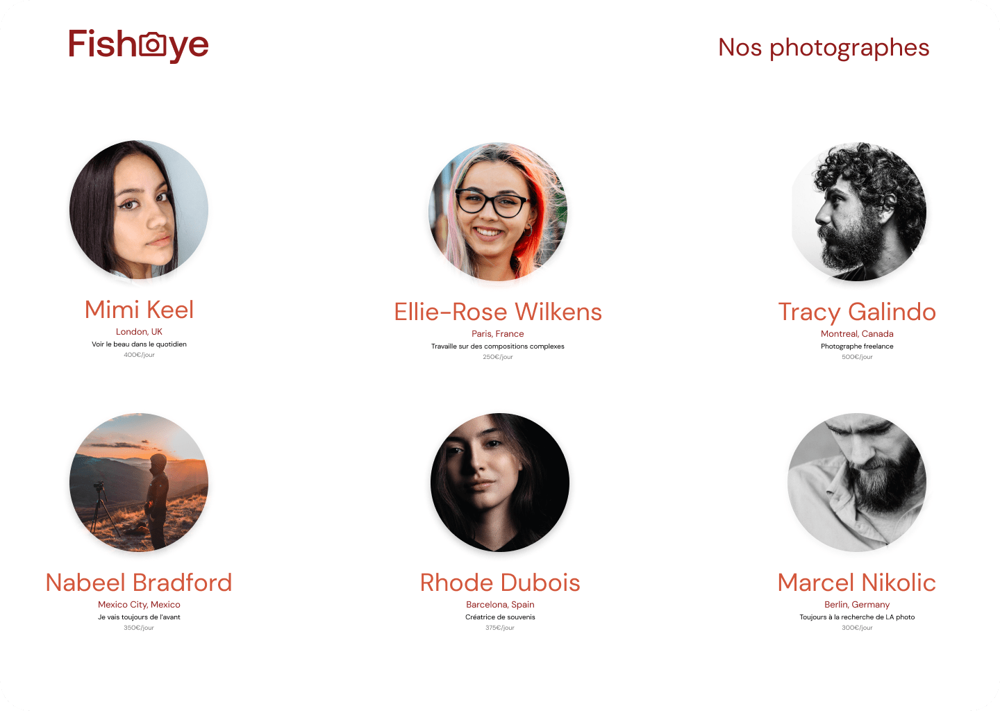

<a id='top'></a>

| Choose Your Language | Choisissez Votre Langue |
| -------------------- | ----------------------- |
| [](#english)  | [](#français) |
|[English](#english)      | [Français](#français) |


___

<a id='english'></a>

|  | This is the English version |
|:---:|:---:|

<h1 align="center">
    FishEye: Creating a Platform for Photographers
</h1>



## Table of Contents
1. [🌟 Introduction](#introduction-en)
2. [🌍 See the Site in Action](#demo-en)
3. [🎓 Affiliation with OpenClassrooms](#openclassrooms-en)
4. [📜 Project Context](#context-en)
5. [🚀 Features](#features-en)
6. [💻 Technologies Used](#technologies-en)
7. [🔍 Specifications](#specifications-en)
8. [🎨 Mockups](#mockups-en)
9. [📁 Project Structure](#structure-en)
10. [🧪 Testing Plan](#testing-plan-en)
11. [👏 Acknowledgements](#thanks-en)
12. [✍️ Contact](#contact-en)
13. [©️ License](#license-en)

## 🌟 Introduction <a id='introduction-en'></a>
Welcome to the FishEye project, an initiative aimed at renewing the online experience for independent photographers. This project, carried out as part of my training with OpenClassrooms, showcases my web development skills in creating a dynamic and accessible platform.

## 🌍 See the Site in Action <a id='demo-en'></a>
Discover the FishEye site and explore the photographers' portfolios by visiting: [FishEye Online](https://fisheye-master.netlify.app).

## 🎓 Affiliation with OpenClassrooms <a id='openclassrooms-en'></a>
This project was developed as part of my web development training at OpenClassrooms, an innovative school offering practical and project-oriented learning.

## 📜 Project Context <a id='context-en'></a>
In this project, I was tasked with building a functional prototype for FishEye, focusing on accessibility and enhancing the user experience for independent photographers.

## 🚀 Features <a id='features-en'></a>
- Dynamic display of photographers' portfolios.
- Design focused on accessibility, including keyboard navigation and compatibility with screen readers.
- Enhanced user interaction with CSS animations and visual effects.

## 💻 Technologies Used <a id='technologies-en'></a>

A variety of technologies and tools were employed for the development of the FishEye project. Here is a detailed overview of these elements:

| Technology | Description |
| ----------- | ----------- |
| [](https://developer.mozilla.org/en-US/docs/Web/Guide/HTML/HTML5) | [**HTML5**](https://developer.mozilla.org/en-US/docs/Web/Guide/HTML/HTML5) for the basic structure of the site. |
| [](https://developer.mozilla.org/en-US/docs/Web/CSS) | [**CSS3**](https://developer.mozilla.org/en-US/docs/Web/CSS) for style and layout. |
| [](https://developer.mozilla.org/en-US/docs/Web/JavaScript) | [**JavaScript**](https://developer.mozilla.org/en-US/docs/Web/JavaScript) for interactivity and dynamic features. |
| [](https://www.figma.com) | [**Figma**](https://www.figma.com) used for mockup design. |
| [](https://code.visualstudio.com/) | [**Visual Studio Code**](https://code.visualstudio.com/) as the code editor. |
| [](https://git-scm.com/) | [**Git**](https://git-scm.com/) for version control and code management. |
| [](https://github.com/) | [**GitHub**](https://github.com/) for collaboration and online code storage. |
| [](https://prettier.io/) | [**Prettier**](https://prettier.io/) for automatic code formatting. |
| [](https://eslint.org/) | [**ESLint**](https://eslint.org/) for static code analysis and quality improvement. |

_These technologies and tools were chosen for their efficiency, ability to provide an optimal user experience, and ease of use, thus contributing to the smooth and professional development of the project._

## 🔍 Specifications <a id='specifications-en'></a>
- Adherence to provided mockups.
- Use of JSON data for dynamic page creation.
- Compliance with accessibility standards.

## 🎨 Mockups <a id='mockups-en'></a>
View the project mockups [here](https://www.figma.com/file/Q3yNeD7WTK9QHDldg9vaRl/UI-Design-FishEye-EN?type=design&node-id=0-1&mode=design&t=s0G1ayuJrEXmH4sI-0).

## 📁 Project Structure <a id='structure-en'></a>
The structure of the FishEye project is designed for clear organization and efficient maintenance. Folders and files are arranged to separate different aspects of development:

```plaintext
FishEye/
├── index.html                    # Home page of the site
├── README.md                     # Project documentation
├── .gitignore                    # File to ignore certain files/folders in Git
├── .eslintrc                     # ESLint configuration for code analysis
├── scripts/                      # JavaScript script folder
│   ├── components/               # Reusable JavaScript components
│   ├── factories/                # Factory Methods for dynamic object creation
│   ├── functions/                # Utility JavaScript functions
│   ├── layouts/                  # Layout and structure scripts
│   └── pages/                    # Scripts specific to individual pages
├── scss/                         # SCSS folder for styles
│   ├── abstract/                 # SCSS variables, mixins, and functions
│   ├── base/                     # Basic styles (resets, typography)
│   ├── components/               # SCSS component styles
│   ├── layouts/                  # SCSS layout styles
│   ├── screens/                  # Styles specific to certain screen sizes
│   └── index.scss                # Main SCSS file that imports all others
├── pages/                        # Folder for additional HTML pages
│   └── photographer.html         # Detailed page for each photographer
├── data/                         # Folder for JSON data
│   └── photographers.json        # JSON data of photographers
├── css/                          # Folder for compiled CSS styles
│   └── style.css                 # Main compiled CSS file from SCSS
└── assets/                       # Folder for static resources
    ├── icons/                    # Icons used on the site
    ├── images/                   # Various images
    ├── photographers/            # Photos of photographers
    └── photos/                   # Photos of photographers' work
```

_This project structure ensures effective separation between presentation elements (HTML, CSS), scripts (JavaScript), data (JSON), and static resources (images, icons), facilitating code navigation and maintenance._

## 🧪 Testing Plan <a id='testing-plan-en'></a>
Manual tests were conducted to ensure the functionality, responsiveness, and accessibility of the site on various devices and browsers.

## 👏 Acknowledgements <a id='thanks-en'></a>
I would like to thank Amanda, the project manager, as well as the entire FishEye and OpenClassrooms team for their support and collaboration in this project.

## ✍️ Contact <a id='contact-en'></a>
For any questions or to discuss future collaborations:
- 📧 **Email:** [master.code.develop@gmail.com](mailto:master.code.develop@gmail.com)
- 🔗 **LinkedIn:** [EL HAMECH Mohamed Ali](https://www.linkedin.com/in/master-dev/)
- 💼 **Portfolio:** [www.elhamech-mohamedali.com](https://www.elhamech-mohamedali.com)

## ©️ License <a id='license-en'></a>
This project is developed as part of my training with OpenClassrooms and is subject to copyright. All rights reserved.

[Back to Top](#top)

___

<a id='français'></a>
|  | Version française |
|:---:|:---:|

<h1 align="center">
    FishEye: Création d'une Plateforme pour Photographes
</h1>


## Sommaire
1. [🌟 Introduction](#introduction-fr)
2. [🌍 Voir le Site en Action](#demo-fr)
3. [🎓 Affiliation à OpenClassrooms](#openclassrooms-fr)
4. [📜 Contexte du Projet](#context-fr)
5. [🚀 Fonctionnalités](#features-fr)
6. [💻 Technologies Utilisées](#technologies-fr)
7. [🔍 Cahier des Charges](#specifications-fr)
8. [🎨 Maquettes](#models-fr)
9. [📁 Structure du Projet](#structure-fr)
10. [🧪 Plan de Test](#testing-plan-fr)
11. [👏 Remerciements](#thanks-fr)
12. [✍️ Contact](#contact-fr)
13. [©️ Licence](#licence-fr)

## 🌟 Introduction <a id='introduction-fr'></a>
Bienvenue sur le projet FishEye, une initiative visant à renouveler l'expérience en ligne pour les photographes indépendants. Ce projet, réalisé dans le cadre de ma formation avec OpenClassrooms, met en avant mes compétences en développement web pour créer une plateforme dynamique et accessible.

## 🌍 Voir le Site en Action <a id='demo-fr'></a>
Découvrez le site FishEye et explorez les portfolios des photographes en visitant : [FishEye en ligne](https://fisheye-master.netlify.app).

## 🎓 Affiliation à OpenClassrooms <a id='openclassrooms-fr'></a>
Ce projet a été développé en tant que partie de ma formation en développement web chez OpenClassrooms, une école innovante offrant un apprentissage pratique et orienté projet.

## 📜 Contexte du Projet <a id='context-fr'></a>
Dans le cadre de ce projet, j'ai été chargé de construire un prototype fonctionnel pour FishEye, en mettant l'accent sur l'accessibilité et l'amélioration de l'expérience utilisateur pour les photographes indépendants.

## 🚀 Fonctionnalités <a id='features-fr'></a>
- Affichage dynamique des portfolios de photographes.
- Conception axée sur l'accessibilité, notamment la navigation au clavier et la compatibilité avec les lecteurs d'écran.
- Interaction utilisateur améliorée avec des animations CSS et des effets visuels.


## 💻 Technologies Utilisées <a id='technologies-fr'></a>

Pour le développement du projet FishEye, une variété de technologies et d'outils a été mise à contribution. Voici un aperçu détaillé de ces éléments :

| Technologie | Description |
| ----------- | ----------- |
| [](https://developer.mozilla.org/fr/docs/Web/Guide/HTML/HTML5) | [**HTML5**](https://developer.mozilla.org/fr/docs/Web/Guide/HTML/HTML5) pour la structure de base du site. |
| [](https://developer.mozilla.org/fr/docs/Web/CSS) | [**CSS3**](https://developer.mozilla.org/fr/docs/Web/CSS) pour le style et la mise en page. |
| [](https://developer.mozilla.org/fr/docs/Web/JavaScript) | [**JavaScript**](https://developer.mozilla.org/fr/docs/Web/JavaScript) pour l'interactivité et les fonctionnalités dynamiques. |
| [](https://www.figma.com) | [**Figma**](https://www.figma.com) utilisé pour la conception des maquettes. |
| [](https://code.visualstudio.com/) | [**Visual Studio Code**](https://code.visualstudio.com/) comme éditeur de code. |
| [](https://git-scm.com/) | [**Git**](https://git-scm.com/) pour le contrôle de version et la gestion du code. |
| [](https://github.com/) | [**GitHub**](https://github.com/) pour la collaboration et le stockage du code en ligne. |
| [](https://prettier.io/) | [**Prettier**](https://prettier.io/) pour le formatage automatique du code. |
| [](https://eslint.org/) | [**ESLint**](https://eslint.org/) pour l'analyse statique du code et l'amélioration de la qualité. |


Ces technologies et outils ont été choisis pour leur efficacité, leur capacité à offrir une expérience utilisateur optimale et leur facilité d'utilisation, contribuant ainsi à un développement fluide et professionnel du projet.

## 🔍 Cahier des Charges <a id='specifications-fr'></a>
- Respect des maquettes fournies.
- Utilisation de données JSON pour la création dynamique des pages.
- Conformité aux normes d'accessibilité.

## 🎨 Maquettes <a id='models-fr'></a>
Consultez les maquettes du projet [ici](https://www.figma.com/file/Q3yNeD7WTK9QHDldg9vaRl/UI-Design-FishEye-FR?type=design&node-id=0-1&mode=design&t=s0G1ayuJrEXmH4sI-0).

## 📁 Structure du Projet <a id='structure-fr'></a>
La structure du projet FishEye est conçue pour une organisation claire et une maintenance efficace. Les dossiers et fichiers sont agencés de manière à séparer les différents aspects du développement :

```plaintext
FishEye/
├── index.html                    # Page d'accueil du site
├── README.md                     # Documentation du projet
├── .gitignore                    # Fichier pour ignorer certains fichiers/dossiers dans Git
├── .eslintrc                     # Configuration d'ESLint pour l'analyse du code
├── scripts/                      # Dossier des scripts JavaScript
│   ├── components/               # Composants JavaScript réutilisables
│   ├── factories/                # Factory Methods pour la création d'objets dynamiques
│   ├── functions/                # Fonctions JavaScript utilitaires
│   ├── layouts/                  # Scripts de mise en page et de structure
│   └── pages/                    # Scripts spécifiques aux pages individuelles
├── scss/                         # Dossier SCSS pour les styles
│   ├── abstract/                 # Variables SCSS, mixins et fonctions
│   ├── base/                     # Styles de base (réinitialisations, typographie)
│   ├── components/               # Styles des composants SCSS
│   ├── layouts/                  # Styles de mise en page SCSS
│   ├── screens/                  # Styles spécifiques à certaines tailles d'écran
│   └── index.scss                # Fichier principal SCSS qui importe tous les autres
├── pages/                        # Dossier pour les pages HTML additionnelles
│   └── photographer.html         # Page détaillée pour chaque photographe
├── data/                         # Dossier pour les données JSON
│   └── photographers.json        # Données JSON des photographes
├── css/                          # Dossier pour les styles CSS compilés
│   └── style.css                 # Fichier CSS principal compilé à partir de SCSS
└── assets/                       # Dossier pour les ressources statiques
    ├── icons/                    # Icônes utilisées sur le site
    ├── images/                   # Images diverses
    ├── photographers/            # Photos des photographes
    └── photos/                   # Photos des travaux des photographes
```

_Cette structure de projet assure une séparation efficace entre les éléments de présentation (HTML, CSS), les scripts (JavaScript), les données (JSON) et les ressources statiques (images, icônes), facilitant la navigation et la maintenance du code._


## 🧪 Plan de Test <a id='testing-plan-fr'></a>
Des tests manuels ont été effectués pour s'assurer de la fonctionnalité, de la réactivité et de l'accessibilité du site sur différents appareils et navigateurs.

## 👏 Remerciements <a id='thanks-fr'></a>
Je tiens à remercier Amanda, la cheffe de projet, ainsi que toute l'équipe de FishEye et OpenClassrooms pour leur soutien et collaboration dans ce projet.

## ✍️ Contact <a id='contact-fr'></a>
Pour toute question ou pour discuter de collaborations futures :
- 📧 **E-mail :** [master.code.develop@gmail.com](mailto:master.code.develop@gmail.com)
- 🔗 **LinkedIn :** [EL HAMECH Mohamed Ali](https://www.linkedin.com/in/master-dev/)
- 💼 **Portfolio :** [www.elhamech-mohamedali.com](https://www.elhamech-mohamedali.com)

## ©️ Licence <a id='licence-fr'></a>
Ce projet est développé dans le cadre de ma formation avec OpenClassrooms et est soumis à des droits d'auteur. Tous droits réservés.

[Retour en haut](#top)
