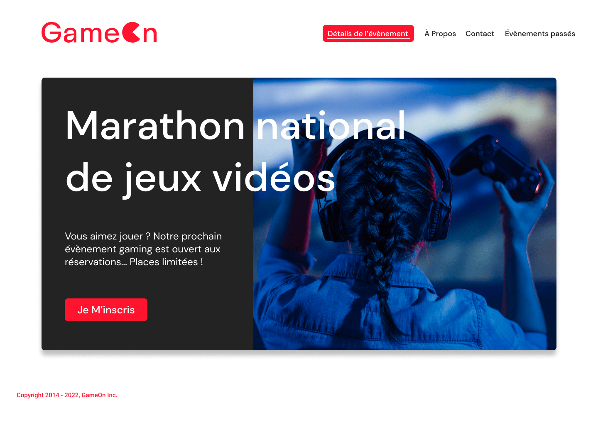

<a id='top'></a>

| Choose Your Language | Choisissez Votre Langue |
| -------------------- | ----------------------- |
| [](#english)  | [](#français) |
|[English](#english)      | [Français](#français) |


___

<a id='english'></a>
|  | English version |
|:---:|:---:|

<h1 align="center">
    GameOn: Creating an Interactive Landing Page with JavaScript
</h1>



## Contents
1. [🌟 Introduction](#introduction-en)
2. [🌍 See the Site in Action](#demo-en)
3. [🚀 Front-End Development](#frontend-development-en)
4. [💻 Technologies Used](#technologies-en)
5. [🔍 Specifications](#specifications-en)
6. [🎨 Mockups](#models-en)
7. [📁 Project Structure](#structure-en)
8. [🧪 Testing Plan](#testing-plan-en)
9. [👏 Acknowledgments](#thanks-en)
10. [✍️ Contact](#contact-en)
11. [©️ License](#licence-en)

## 🌟 Introduction <a id='introduction-en'></a>
Welcome to the GameOn project, where I focused on enhancing user experience and interaction on an online contest site. My role was to energize the web page with JavaScript, based on the provided mockups.

## 🌍 See the Site in Action <a id='demo-en'></a>
To explore the interactive GameOn page, visit: [GameOn in Action](https://game-on-master.netlify.app).

## 🚀 Front-End Development <a id='frontend-development-en'></a>
My mission included adding JavaScript code to make the form fully functional, adhering to guidelines, and ensuring smooth user interaction.

## 💻 Technologies Used <a id='technologies-en'></a>

The development of the interactive landing page for GameOn involved the use of various technologies and tools. Here is a detailed overview of these elements:

| Technology | Description |
| ----------- | ----------- |
| [](https://developer.mozilla.org/en/docs/Web/Guide/HTML/HTML5) | **HTML5** for the basic structure of the page. |
| [](https://developer.mozilla.org/en/docs/Web/CSS) | **CSS3** for styling and layout. |
| [](https://developer.mozilla.org/en/docs/Web/JavaScript) | **JavaScript** for interactivity and animations. |
| [](https://code.visualstudio.com/) | **Visual Studio Code** for code editing and management. |
| [](https://git-scm.com/) | **Git** for tracking changes and version control. |
| [](https://github.com/) | **GitHub** for online code storage and collaboration. |
| [](https://www.figma.com) | **Figma** for UI design and prototyping. |
| [](https://prettier.io/) | **Prettier** for automatic code formatting. |
| [](https://eslint.org/) | **ESLint** for static code analysis and detecting issues. |

These technologies and tools were chosen for their reliability and efficiency, contributing to an improved user experience and facilitating project development.

## 🔍 Specifications <a id='specifications-en'></a>
- Use of JavaScript without jQuery.
- Separation of HTML, CSS, and JavaScript files.
- Adherence to W3C standards.
- Compatibility with Chrome and Firefox.
- Detailed comments in the code.
- Responsive.

## 🎨 Mockups <a id='models-en'></a>
The mockups of the GameOn project, providing a clear overview of the expected design and structure, can be found [here](https://www.figma.com/file/B7NKBDvSI18uoMLJgpnh48/UI-Design-GameOn-EN?node-id=106%3A630).

## 📁 Project Structure <a id='structure-en'></a>

The GameOn project's structure is organized as follows for clear navigation and easy maintenance:

```plaintext
GameOn/
├── index.html                 # Main page of the site
└── assets/                    # Resources folder
    ├── css/                   # Folder for CSS style sheets
    │   └── styles.css         # Main style sheet
    ├── img/                   # Folder for images
    │   ├── [various images]   # Images used on the site
    └── js/                    # Folder for JavaScript scripts
        └── script.js          # Main JavaScript script
```

This structure ensures a clear organization of the project, separating static resources (like images and CSS styles) from the JavaScript script, thus facilitating development and maintenance.

## 🧪 Testing Plan <a id='testing-plan-en'></a>
Manual tests were performed to ensure the proper functioning of features, form entries, and responsiveness on different devices.

## 👏 Acknowledgments <a id='thanks-en'></a>
I would like to thank Erika, the CTO, as well as the entire GameOn team and OpenClassrooms for their support in completing this project.

## ✍️ Contact <a id='contact-en'></a>
For any inquiries or to discuss future collaborations:
- 📧 **Email:** [master.code.develop@gmail.com](mailto:master.code.develop@gmail.com)
- 🔗 **LinkedIn:** [EL HAMECH Mohamed Ali](https://www.linkedin.com/in/master-dev/)
- 💼 **Portfolio:** [www.elhamech-mohamedali.com](https://www.elhamech-mohamedali.com)

## ©️ License <a id='licence-en'></a>
This project is affiliated with OpenClassrooms and carried out as part of my web development training. All rights reserved.

[Back to Top](#top)


___

<a id='français'></a>
|  | Version française |
|:---:|:---:|

<h1 align="center">
    GameOn: Création d'un Landing Page Interactive avec JavaScript
</h1>


## Sommaire
1. [🌟 Introduction](#introduction-fr)
2. [🌍 Voir le Site en Action](#demo-fr)
3. [🚀 Développement Front-End](#frontend-development-fr)
4. [💻 Technologies Utilisées](#technologies-fr)
5. [🔍 Cahier des Charges](#specifications-fr)
6. [🎨 Maquettes](#models-fr)
7. [📁 Structure du Projet](#structure-fr)
8. [🧪 Plan de Test](#testing-plan-fr)
9. [👏 Remerciements](#thanks-fr)
10. [✍️ Contact](#contact-fr)
11. [©️ Licence](#licence-fr)

## 🌟 Introduction <a id='introduction-fr'></a>
Bienvenue sur le projet GameOn, où je me suis concentré sur l'amélioration de l'expérience utilisateur et l'interaction sur un site de concours en ligne. Mon rôle était de dynamiser la page web avec JavaScript, basé sur les maquettes fournies.

## 🌍 Voir le Site en Action <a id='demo-fr'></a>
Pour explorer la page interactive GameOn, visitez : [GameOn en Action](https://game-on-master.netlify.app).

## 🚀 Développement Front-End <a id='frontend-development-fr'></a>
Ma mission comprenait l'ajout de code JavaScript pour rendre le formulaire pleinement fonctionnel, en respectant les guidelines et en assurant une interaction utilisateur fluide.


## 💻 Technologies Utilisées <a id='technologies-fr'></a>

Le développement de la landing page interactive pour GameOn a impliqué l'utilisation de diverses technologies et outils. Voici un aperçu détaillé de ces éléments :

| Technologie | Description |
| ----------- | ----------- |
| [](https://developer.mozilla.org/fr/docs/Web/Guide/HTML/HTML5) | **HTML5** pour la structure de base de la page. |
| [](https://developer.mozilla.org/fr/docs/Web/CSS) | **CSS3** pour le style et la mise en page. |
| [](https://developer.mozilla.org/fr/docs/Web/JavaScript) | **JavaScript** pour l'interactivité et les animations. |
| [](https://code.visualstudio.com/) | **Visual Studio Code** pour l'édition et la gestion du code. |
| [](https://git-scm.com/) | **Git** pour le suivi des modifications et la gestion de versions. |
| [](https://github.com/) | **GitHub** pour le stockage et la collaboration sur le code en ligne. |
| [](https://www.figma.com) | **Figma** pour la conception et le prototypage des interfaces utilisateur. |
| [](https://prettier.io/) | **Prettier** pour le formatage automatique du code. |
| [](https://eslint.org/) | **ESLint** pour l'analyse statique du code et la détection des problèmes. |

Ces technologies et outils ont été choisis pour leur fiabilité et leur efficacité, contribuant à une expérience utilisateur améliorée et facilitant le développement du projet.

## 🔍 Cahier des Charges <a id='specifications-fr'></a>
- Utilisation de JavaScript sans jQuery.
- Séparation des fichiers HTML, CSS et JavaScript.
- Conformité aux normes W3C.
- Compatibilité avec Chrome et Firefox.
- Commentaires détaillés dans le code.
- Responsives

## 🎨 Maquettes <a id='models-fr'></a>
Les maquettes du projet GameOn, fournissant un aperçu clair de la conception et de la structure attendues, sont disponibles [ici](https://www.figma.com/file/B7NKBDvSI18uoMLJgpnh48/UI-Design-GameOn-FR?node-id=106%3A630).

## 📁 Structure du Projet <a id='structure-fr'></a>

La structure du projet GameOn est organisée comme suit pour une navigation et une maintenance claires :

```plaintext
GameOn/
├── index.html                 # Page principale du site
└── assets/                    # Dossier des ressources
    ├── css/                   # Dossier pour les feuilles de style CSS
    │   └── styles.css         # Feuille de style principale
    ├── img/                   # Dossier pour les images
    │   ├── [diverses images]  # Images utilisées sur le site
    └── js/                    # Dossier pour les scripts JavaScript
        └── script.js          # Script principal JavaScript
```

Cette structure assure une organisation claire du projet, en séparant les ressources statiques (comme les images et les styles CSS) du script JavaScript, facilitant ainsi le développement et la maintenance.

## 🧪 Plan de Test <a id='testing-plan-fr'></a>
Des tests manuels ont été effectués pour assurer le bon fonctionnement des fonctionnalités, la validation des formulaires et la réactivité sur différents appareils.

## 👏 Remerciements <a id='thanks-fr'></a>
Je tiens à remercier Erika, le CTO, ainsi que toute l'équipe de GameOn et OpenClassrooms pour leur soutien dans la réalisation de ce projet.

## ✍️ Contact <a id='contact-fr'></a>
Pour toute question ou pour discuter de collaborations futures :
- 📧 **E-mail :** [master.code.develop@gmail.com](mailto:master.code.develop@gmail.com)
- 🔗 **LinkedIn :** [EL HAMECH Mohamed Ali](https://www.linkedin.com/in/master-dev/)
- 💼 **Portfolio :** [www.elhamech-mohamedali.com](https://www.elhamech-mohamedali.com)

## ©️ Licence <a id='licence-fr'></a>
Ce projet est affilié à OpenClassrooms et réalisé dans le cadre de ma formation en développement web. Tous droits réservés.

[Retour en haut](#top)