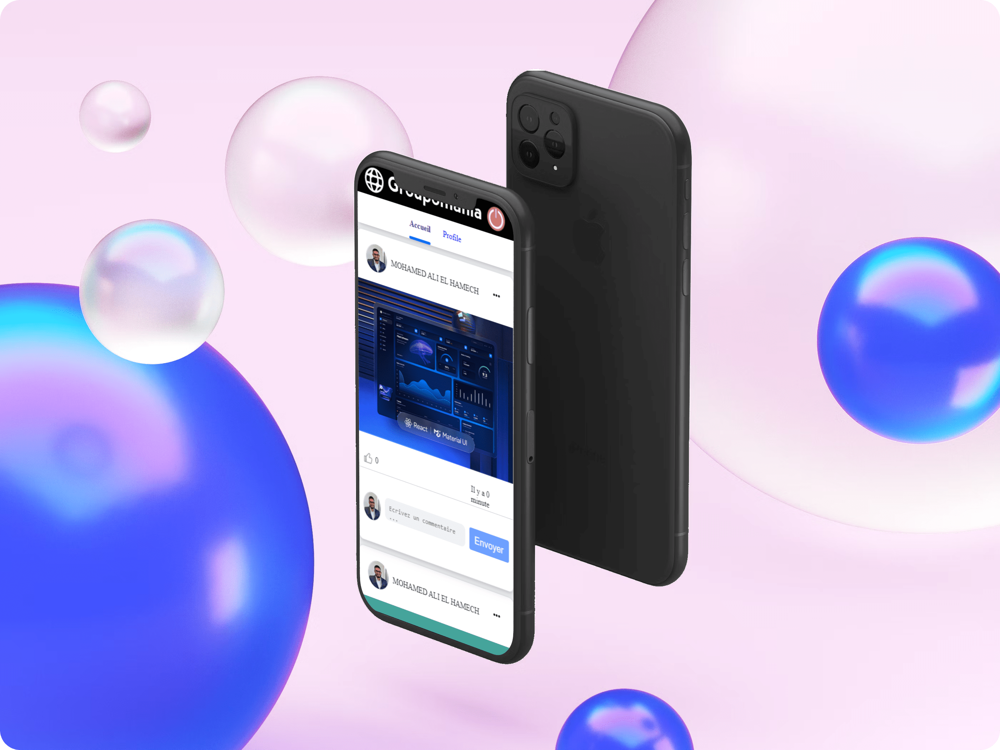

| Choose Your Language | Choisissez Votre Langue |
| -------------------- | ----------------------- |
|   |  |
|[English](#english)      | [Français](#français) |

___

|  | This is the English version |
|:---:|:---:|

<h1 align="center">
    Groupomania: Creating a Corporate Social Network
</h1>

## Table of Contents
1. [🌟 Introduction](#introduction-en)
2. [🎯 Project Objective](#objective-en)
3. [🚀 Features](#features-en)
4. [💻 Technologies Used](#technologies-en)
5. [🔐 Security](#security-en)
6. [🔍 Technical Specifications](#specifications-en)
7. [🤝 Contributing](#contribute-en)
8. [📬 Contact](#contact-en)
9. [👏 Acknowledgements](#thanks-en)
10. [✍️ Author](#author-en)
11. [©️ License](#licence-en)

## 🌟 Introduction 
Welcome to the repository of **Groupomania**, an internal social network designed to facilitate interactions among employees of Groupomania, a leader in the retail industry.

## 🎯 Project Objective 
The goal of this project was to create a space where Groupomania employees could share and interact in a friendly manner, strengthening the social bond within the company.

## 🚀 Features 
- User authentication and session management.
- Information sharing and interactions among employees.
- Adherence to security standards for data protection.

## 💻 Technologies Used 

A range of technologies and tools were used for the development of Groupomania, ensuring efficiency, optimal user experience, and ease of use. Here's a detailed overview:

| Technology | Description |
| ----------- | ----------- |
|  | [**ReactJS**](https://reactjs.org/) for front-end development, offering a reactive and interactive user interface. |
|  | [**SCSS**](https://sass-lang.com/) for styling, allowing advanced customization and flexible style management. |
|  | [**NodeJS**](https://nodejs.org/en/) for back-end development, handling business logic and database interactions. |
|  | [**MySQL**](https://www.mysql.com/) chosen for its reliability and efficient data management. |
|  | [**JavaScript**](https://developer.mozilla.org/en-US/docs/Web/JavaScript) for dynamic API integration and creating interactive features. |
|  | [**ESLint**](https://eslint.org/) for static code analysis and quality improvement. |
|  | [**Prettier**](https://prettier.io/) for automatic code formatting. |
|  | [**Visual Studio Code**](https://code.visualstudio.com/) as the code editor. |
|  | [**Postman**](https://www.postman.com/) for testing and debugging API requests. |
|  | [**Express**](https://expressjs.com/) as a framework for Node.js web applications. |

_These technologies and tools were chosen for their effectiveness, their ability to provide an optimal user experience, and their ease of use, contributing to the smooth and professional development of the Groupomania project._

## 🔐 Security 
Rigorous security measures were put in place, particularly for password protection and securing user data.

## 🔍 Technical Specifications 
- Implementation of secure data storage.
- Development of a user interface using a front-end framework.
- Compliance with WCAG standards and best development practices.

## 🤝 Contributing 
Any contribution aimed at improving the project is welcome. Feel free to contact me for any suggestions or collaboration requests.

## 📬 Contact 
For any questions or collaboration requests, please contact me at the following address:

- 📧 **Email:** [master.code.develop@gmail.com](mailto:master.code.develop@gmail.com)
- 🔗 **LinkedIn:** [EL HAMECH Mohamed Ali](https://www.linkedin.com/in/master-dev/)

## 👏 Acknowledgements 
I extend my warmest thanks to the Groupomania team for their trust, and to my colleagues at CONNECT-E for their support throughout this project.

## ✍️ Author 
This project was designed and developed by Mohamed Ali EL HAMECH in affiliation with OPENCLASSROOMS, passionate about web development and new technologies. For more information about my projects and career:

- 🔗 **LinkedIn:** [EL HAMECH Mohamed Ali](https://www.linkedin.com/in/master-dev/)
- 💼 **Portfolio:** [www.elhamech-mohamedali.com](https://www.elhamech-mohamedali.com)

## ©️ License 
This project is protected by copyright and is intended for personal and educational use only. Any use, copying, or distribution without permission is strictly prohibited.

[Back to top](#top)

___

|  | Version française |
|:---:|:---:|

<h1 align="center">
    Groupomania : Création d'un réseau social d'entreprise
</h1>

## Sommaire
1. [🌟 Introduction](#introduction-fr)
2. [🎯 Objectif du Projet](#objective-fr)
3. [🚀 Fonctionnalités](#features-fr)
4. [💻 Technologies Utilisées](#technologies-fr)
5. [🔐 Sécurité](#security-fr)
6. [🔍 Spécifications Techniques](#specifications-fr)
7. [🤝 Contribuer](#contribute-fr)
8. [📬 Contact](#contact-fr)
9. [👏 Remerciements](#thanks-fr)
10. [✍️ Auteur](#author-fr)
11. [©️ Licence](#licence-fr)

## 🌟 Introduction 
Bienvenue sur le dépôt du projet **Groupomania**, un réseau social interne conçu pour faciliter les interactions entre les employés de Groupomania, un leader de la grande distribution.

## 🎯 Objectif du Projet 
Ce projet avait pour objectif de créer un espace où les employés de Groupomania pourraient partager et interagir de manière conviviale, en renforçant le lien social au sein de l'entreprise.

## 🚀 Fonctionnalités 
- Authentification et gestion des sessions utilisateurs.
- Partage d'informations et interactions entre employés.
- Respect des normes de sécurité pour la protection des données.

## 💻 Technologies Utilisées 

Une gamme de technologies et d'outils a été utilisée pour le développement de Groupomania, assurant efficacité, expérience utilisateur optimale et facilité d'utilisation. Voici un aperçu détaillé :

| Technologie | Description |
| ----------- | ----------- |
|  | [**ReactJS**](https://fr.reactjs.org/) pour le développement du front-end, offrant une interface utilisateur réactive et interactive. |
|  | [**SCSS**](https://sass-lang.com/) pour le stylisme, permettant une personnalisation avancée et une gestion flexible des styles. |
|  | [**NodeJS**](https://nodejs.org/fr/) pour le développement du back-end, gérant la logique métier et les interactions avec la base de données. |
|  | [**MySQL**](https://www.mysql.com/fr/) pour sa fiabilité et sa gestion efficace des données. |
|  | [**JavaScript**](https://developer.mozilla.org/fr/docs/Web/JavaScript) pour l'intégration dynamique de l'API et la création de fonctionnalités interactives. |
|  | [**ESLint**](https://eslint.org/) pour l'analyse statique du code et l'amélioration de la qualité. |
|  | [**Prettier**](https://prettier.io/) pour le formatage automatique du code. |
|  | [**Visual Studio Code**](https://code.visualstudio.com/) comme éditeur de code. |
|  | [**Postman**](https://www.postman.com/) pour tester et déboguer les requêtes API. |
|  | [**Express**](https://expressjs.com/fr/) comme framework pour applications web Node.js. |

_Ces technologies et outils ont été choisis pour leur efficacité, leur capacité à offrir une expérience utilisateur optimale et leur facilité d'utilisation, contribuant ainsi à un développement fluide et professionnel du projet Groupomania._

## 🔐 Sécurité 
Des mesures de sécurité rigoureuses ont été mises en place, notamment pour la protection des mots de passe et la sécurisation des données utilisateur.

## 🔍 Spécifications Techniques 
- Mise en œuvre d'un stockage de données sécurisé.
- Développement d'une interface utilisateur avec un framework front-end.
- Respect des normes WCAG et des meilleures pratiques de développement.

## 🤝 Contribuer 
Toute contribution visant à améliorer le projet est bienvenue. N'hésitez pas à me contacter pour toute suggestion ou demande de collaboration.

## 📬 Contact 
Pour toute question ou demande de collaboration, merci de me contacter à l'adresse suivante :

- 📧 **E-mail :** [master.code.develop@gmail.com](mailto:master.code.develop@gmail.com)
- 🔗 **LinkedIn :** [EL HAMECH Mohamed Ali](https://www.linkedin.com/in/master-dev/)

## 👏 Remerciements 
Je remercie chaleureusement l'équipe de Groupomania pour leur confiance, ainsi que mes collègues chez CONNECT-E pour leur soutien tout au long de ce projet.

## ✍️ Auteur 
Ce projet a été conçu et développé par Mohamed Ali EL HAMECH en affiliation avec OPENCLASSROOMS, passionné par le développement web et les nouvelles technologies. Pour plus d'informations sur mes projets et mon parcours :

- 🔗 **LinkedIn :** [EL HAMECH Mohamed Ali](https://www.linkedin.com/in/master-dev/)
- 💼 **Portfolio :** [www.elhamech-mohamedali.com](https://www.elhamech-mohamedali.com)

## ©️ Licence 
Ce projet est protégé par des droits d'auteur et est destiné à un usage exclusivement personnel et éducatif. Toute utilisation, copie ou distribution sans autorisation est strictement interdite.

[Retour en haut](#top)
