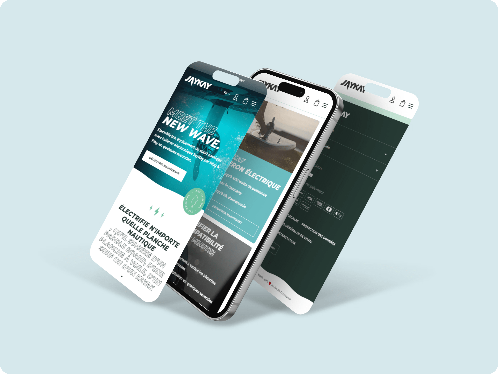

| Choose Your Language | Choisissez Votre Langue |
| -------------------- | ----------------------- |
|   |  |
|[English](#english)      | [Français](#français) |

___

|  | English Version |
|:---:|:---:|

<h1 align="center">
    Jaykay-sport: Complete Overhaul for Enhanced User Experience
</h1>

## Table of Contents
1. [🌟 Introduction](#introduction-en)
2. [🔍 Project Overview](#overview-en)
3. [🛠️ Tasks and Achievements](#tasks-en)
4. [💻 Technologies Used](#technologies-en)
5. [📈 Results and Impact](#results-en)
6. [👏 Acknowledgements](#thanks-en)
7. [✍️ Author](#author-en)
8. [©️ License](#licence-en)

## 🌟 Introduction 
Welcome to the Jaykay-sport website overhaul project, where my primary goal was to enhance user experience and modernize the interface while maintaining easy management for the client.

## 🔍 Project Overview 
Leading the transformation of Jaykay's website, my role involved analyzing, designing, and developing key pages for better interactivity and responsive design, integrating a CMS for dynamic content management.

## 🛠️ Tasks and Achievements 
- **Existing Site Analysis**: Detailed evaluation to identify strengths and weaknesses for improvement in functionality and user experience.
- **Design and Development**: Creation of key pages with a focus on user interactivity and responsive design, suitable for all devices.
- **Interface Modernization**: Updating the user interface to provide intuitive navigation and visually appealing design.
- **User Experience Optimization**: Enhancing site ergonomics to ensure a smooth and engaging user experience.
- **Efficient Delivery**: Meeting project deadlines with successful finalization and launch before the set deadline.

## 💻 Technologies Used 

The Jaykay-sport site redesign required the use of advanced front-end and back-end technologies to ensure a modern and smooth user experience. Here is a detailed overview of the key technologies used in this project:

| Technology | Description |
| ----------- | ----------- |
|  | [**ReactJS**](https://reactjs.org/) for creating a dynamic and responsive user interface. |
|  | [**AlpineJS**](https://alpinejs.dev/) for adding interactive behaviors with a light footprint. |
|  | [**Shopify**](https://www.shopify.com) to integrate e-commerce and product management solutions. |
|  | [**PayPal**](https://www.paypal.com) for secure financial transactions. |
|  | [**Apple Pay**](https://www.apple.com/apple-pay/) to offer a convenient mobile payment option. |
|  | [**CSS3**](https://developer.mozilla.org/en/docs/Web/CSS) for styling and layout. |
|  | [**styled-components**](https://styled-components.com/) for styling React components. |
|  | [**Weglot**](https://weglot.com/) to facilitate translation and site localization. |

_This combination of technologies allowed for the creation of a website that is both aesthetically pleasing, functional, and easy to manage, while providing an optimized user experience._

## 📈 Results and Impact 
- Significant UX/UI improvement.
- Optimized site performance for SEO and speed.
- High client satisfaction with positive feedback.

## 👏 Acknowledgements 
I would like to thank the Jaykay-sport team for their trust and collaboration in this ambitious project.

## ✍️ Author 
This project was a rewarding experience, allowing me to refine my web development skills and work with cutting-edge technologies.

- 📧 **E-mail:** [master.code.develop@gmail.com](mailto:master.code.develop@gmail.com)
- 🔗 **LinkedIn:** [Mohamed-Ali EL HAMECH](https://www.linkedin.com/in/master-dev/)
- 💼 **Portfolio:** [www.elhamech-mohamedali.com](https://www.elhamech-mohamedali.com)

## ©️ License 
This project is intended for personal and educational use. All rights reserved.

[Back to top](#top)
___

|  | Version française |
|:---:|:---:|

<h1 align="center">
    Jaykay-sport : Refonte Complète pour une Expérience Utilisateur Optimisée
</h1>

## Sommaire
1. [🌟 Introduction](#introduction-fr)
2. [🔍 Aperçu du Projet](#overview-fr)
3. [🛠️ Tâches et Réalisations](#tasks-fr)
4. [💻 Technologies Utilisées](#technologies-fr)
5. [📈 Résultats et Impact](#results-fr)
6. [👏 Remerciements](#thanks-fr)
7. [✍️ Auteur](#author-fr)
8. [©️ Licence](#licence-fr)

## 🌟 Introduction 
Bienvenue sur le projet de refonte du site Jaykay-sport, où mon objectif principal était d'améliorer l'expérience utilisateur et de moderniser l'interface, tout en conservant une gestion aisée pour le client.

## 🔍 Aperçu du Projet 
Dirigeant la transformation du site de Jaykay, mon rôle était d'analyser, concevoir et développer les pages clés pour une meilleure interactivité et un design responsive, intégrant un CMS pour une gestion de contenu dynamique.

## 🛠️ Tâches et Réalisations 
- **Analyse du Site Existant** : Évaluation détaillée pour identifier les opportunités d'amélioration en termes de fonctionnalités et d'expérience utilisateur.
- **Conception et Développement** : Création de pages clés avec une attention particulière à l'interactivité utilisateur et au design responsive, adaptées à tous les appareils.
- **Modernisation de l'Interface** : Mise à jour de l'interface utilisateur pour offrir une navigation intuitive et un design visuellement attrayant.
- **Optimisation de l'Expérience Utilisateur** : Amélioration de l'ergonomie du site, assurant une expérience utilisateur fluide et engageante.
- **Livraison Efficace** : Respect des délais du projet, avec une finalisation et une mise en ligne réussies avant la date butoir.

## 💻 Technologies Utilisées 

La refonte du site Jaykay-sport a nécessité l'utilisation de technologies front-end et back-end avancées pour assurer une expérience utilisateur moderne et fluide. Voici un aperçu détaillé des technologies clés utilisées dans ce projet :

| Technologie | Description |
| ----------- | ----------- |
|  | [**ReactJS**](https://reactjs.org/) pour créer une interface utilisateur dynamique et réactive. |
|  | [**AlpineJS**](https://alpinejs.dev/) pour ajouter des comportements interactifs avec une empreinte légère. |
|  | [**Shopify**](https://www.shopify.com) pour intégrer des solutions d'e-commerce et de gestion des produits. |
|  | [**PayPal**](https://www.paypal.com) pour les transactions financières sécurisées. |
|  | [**Apple Pay**](https://www.apple.com/apple-pay/) pour offrir une option de paiement mobile pratique. |
|  | [**CSS3**](https://developer.mozilla.org/fr/docs/Web/CSS) pour le styling et la mise en page. |
|  | [**styled-components**](https://styled-components.com/) pour le styling des composants React. |
|  | [**Weglot**](https://weglot.com/) pour faciliter la traduction et la localisation du site. |

_Cette combinaison de technologies a permis de créer un site web à la fois esthétique, fonctionnel, et facile à gérer, tout en offrant une expérience utilisateur optimisée._

## 📈 Résultats et Impact 
- Amélioration significative de l'UX/UI.
- Optimisation des performances pour le SEO et la vitesse.
- Satisfaction client élevée avec des retours positifs.

## 👏 Remerciements 
Je remercie l'équipe de Jaykay-sport pour leur confiance et leur collaboration dans ce projet ambitieux.

## ✍️ Auteur 
Ce projet a été une expérience enrichissante, permettant d'affiner mes compétences en développement web et de travailler avec des technologies de pointe.

- 📧 **E-mail:** [master.code.develop@gmail.com](mailto:master.code.develop@gmail.com)
- 🔗 **LinkedIn:** [Mohamed-Ali EL HAMECH](https://www.linkedin.com/in/master-dev/)
- 💼 **Portfolio:** [www.elhamech-mohamedali.com](https://www.elhamech-mohamedali.com)

## ©️ Licence 
Ce projet est destiné à un usage personnel et éducatif. Tous droits réservés.

[Retour en haut](#top)