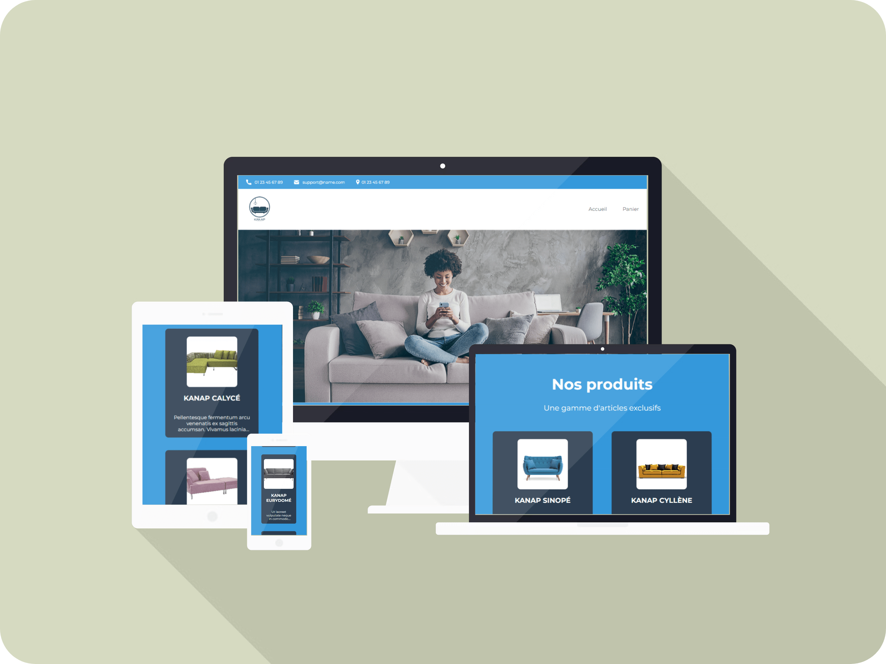

| Choose Your Language | Choisissez Votre Langue |
| -------------------- | ----------------------- |
|   |  |
|[English](#english)      | [Français](#français) |

___

|  | English Version |
|:---:|:---:|

<h1 align="center">
    Kanap: Creating an E-commerce Platform for Sofas
</h1>

## Table of Contents
1. [🌟 Introduction](#introduction-en)
2. [🌍 See the Site in Action](#demo-en)
3. [👥 Team Collaboration](#team-en)
4. [🚀 Features](#features-en)
5. [💻 Technologies Used](#technologies-en)
6. [📈 Impact and Improvements](#impact-en)
7. [📁 Project Structure](#structure-en)
8. [🧪 Acceptance Testing Plan](#testing-en)
9. [👏 Acknowledgements](#thanks-en)
10. [✍️ Contact](#contact-en)
11. [©️ License](#license-en)

## 🌟 Introduction 
Welcome to the Kanap project, an innovative e-commerce platform for the Kanap sofa brand. This project aims to extend Kanap's presence from its physical store to an online platform.

## 🌍 See the Site in Action 
Explore the Kanap e-commerce platform in action by visiting: [Kanap E-Commerce](https://kanap-master.netlify.app).

## 👥 Team Collaboration 
This project was realized in collaboration with:
- Corinne, the agency CTO.
- Frank, the front-end developer.
- Bilal, the back-end developer.

## 🚀 Features 
- Dynamic integration of products via an API.
- Shopping cart management.
- Order process and confirmation.

## 💻 Technologies Used 
A variety of technologies and tools were used for the development of the Kanap e-commerce platform. Here is a detailed overview:

| Technology | Description |
| ----------- | ----------- |
|  | **HTML5** for the basic structure of the site. |
|  | **CSS3** for styling and layout. |
|  | **JavaScript** for site dynamism and API integration. |
|  | **Node.js** as the backend execution environment. |
|  | **Express.js** for robust API creation. |
|  | **Visual Studio Code** as the code editor. |
|  | **Git** for version control. |
|  | **GitHub** for online code storage and management. |

_These technologies and tools were selected for their effectiveness and ability to provide an optimal user experience while facilitating project development and maintenance._

## 📈 Impact and Improvements 
The improvements have transformed a static site into a functional and dynamic e-commerce platform, offering an enhanced user experience.

## 📁 Project Structure 
The project is organized into several pages: Home, Product, Cart, and Confirmation, each playing a specific role in the user journey.

## 🧪 Acceptance Testing Plan 
An acceptance testing plan was implemented to ensure that each feature meets quality criteria and user experience standards.

## 👏 Acknowledgements 
A big thank you to the Kanap team and OpenClassrooms for their support and collaboration throughout this project.

## ✍️ Contact 
For more information or to discuss collaborations, feel free to contact me:
- 📧 **Email:** [master.code.develop@gmail.com](mailto:master.code.develop@gmail.com)
- 🔗 **LinkedIn:** [EL HAMECH Mohamed Ali](https://www.linkedin.com/in/master-dev/)
- 💼 **Portfolio:** [www.elhamech-mohamedali.com](https://www.elhamech-mohamedali.com)

## ©️ License 
This project is developed as part of my collaboration with Kanap and affiliated with OpenClassrooms. All rights reserved.

[Back to Top](#top)

___

|  | Version française |
|:---:|:---:|

<h1 align="center">
    Kanap: Création d'une Plateforme E-commerce de Canapés
</h1>

## Sommaire
1. [🌟 Introduction](#introduction-fr)
2. [🌍 Voir le Site en Action](#demo-fr)
3. [👥 Collaboration d'Équipe](#team-fr)
4. [🚀 Fonctionnalités](#functionalities-fr)
5. [💻 Technologies Utilisées](#technologies-fr)
6. [📈 Impact et Améliorations](#impact-fr)
7. [📁 Structure du Projet](#structure-fr)
8. [🧪 Plan de Test d'Acceptation](#testing-fr)
9. [👏 Remerciements](#thanks-fr)
10. [✍️ Contact](#contact-fr)
11. [©️ Licence](#licence-fr)

## 🌟 Introduction 
Bienvenue sur le projet Kanap, une plateforme e-commerce innovante pour la marque de canapés Kanap. Ce projet vise à étendre la présence de Kanap de sa boutique physique à une plateforme en ligne.

## 🌍 Voir le Site en Action 
Découvrez la plateforme e-commerce de Kanap en action en visitant : [Kanap E-Commerce](https://kanap-master.netlify.app).

## 👥 Collaboration d'Équipe 
Ce projet a été réalisé en collaboration avec :
- Corinne, le CTO de l’agence.
- Frank, le développeur front-end.
- Bilal, le développeur back-end.

## 🚀 Fonctionnalités 
- Intégration dynamique des produits via une API.
- Gestion d'un panier d'achat.
- Processus de commande et confirmation.

## 💻 Technologies Utilisées 

Pour le développement de la plateforme e-commerce Kanap, une gamme variée de technologies et d'outils a été utilisée. Voici un aperçu détaillé :

| Technologie | Description |
| ----------- | ----------- |
|  | **HTML5** pour la structure de base du site. |
|  | **CSS3** pour le style et la mise en page. |
|  | **JavaScript** pour la dynamisation du site et l'intégration avec l'API. |
|  | **Node.js** comme environnement d'exécution pour le back-end. |
|  | **Express.js** pour la création d'APIs robustes. |
|  | **Visual Studio Code** comme éditeur de code. |
|  | **Git** pour le contrôle de version. |
|  | **GitHub** pour le stockage et la gestion de code en ligne. |

_Ces technologies et outils ont été sélectionnés pour leur efficacité et leur capacité à fournir une expérience utilisateur optimale tout en facilitant le développement et la maintenance du projet._

## 📈 Impact et Améliorations 
Les améliorations ont permis de transformer un site statique en une plateforme e-commerce fonctionnelle et dynamique, offrant une expérience utilisateur améliorée.

## 📁 Structure du Projet 
Le projet est organisé en plusieurs pages : Accueil, Produit, Panier et Confirmation, chacune ayant un rôle spécifique dans le parcours utilisateur.

## 🧪 Plan de Test d'Acceptation 
Un plan de test d'acceptation a été mis en place pour s'assurer que chaque fonctionnalité répond aux critères de qualité et d'expérience utilisateur.

## 👏 Remerciements 
Un grand merci à l'équipe de Kanap et à OpenClassrooms pour leur soutien et collaboration tout au long de ce projet.

## ✍️ Contact 
Pour plus d'informations ou pour discuter de collaborations, n'hésitez pas à me contacter :
- 📧 **E-mail :** [master.code.develop@gmail.com](mailto:master.code.develop@gmail.com)
- 🔗 **LinkedIn :** [EL HAMECH Mohamed Ali](https://www.linkedin.com/in/master-dev/)
- 💼 **Portfolio :** [www.elhamech-mohamedali.com](https://www.elhamech-mohamedali.com)

## ©️ Licence 
Ce projet est développé dans le cadre de ma collaboration avec Kanap et affilié à OpenClassrooms. Tous droits réservés.

[Retour en haut](#top)
