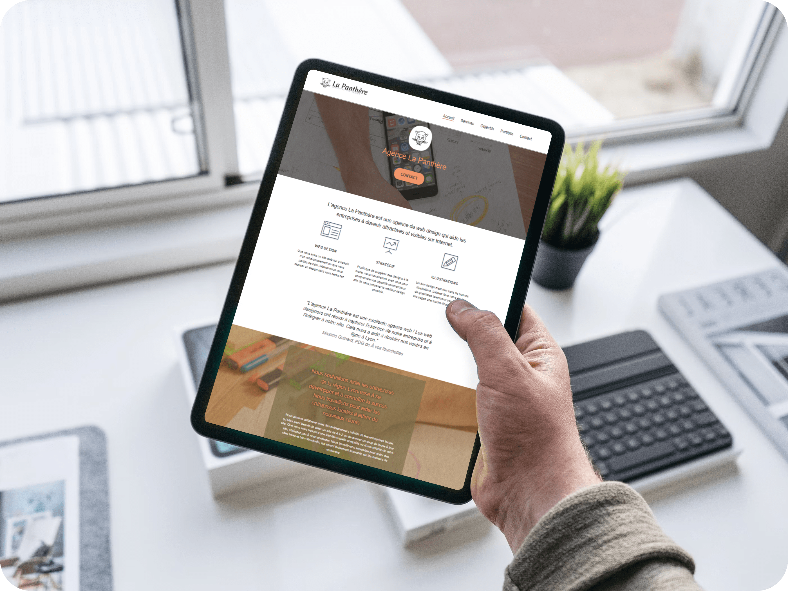

| Choose Your Language | Choisissez Votre Langue |
| -------------------- | ----------------------- |
|   |  |
|[English](#english)      | [Français](#français) |

___

|  | English version |
|:---:|:---:|

<h1 align="center">
    La Panthère: SEO Optimization for a Web Design Agency in Lyon
</h1>

## Table of Contents
1. [🌟 Introduction](#introduction-en)
2. [🔍 SEO Analysis](#seo-analysis-en)
3. [🌍 See the Site in Action](#demo-en)
4. [🚀 SEO Optimization](#seo-optimization-en)
5. [📈 Impact and Improvements](#impact-en)
6. [💻 Technologies Used](#technologies-en)
7. [📁 Project Structure](#structure-en)
8. [👏 Acknowledgements](#thanks-en)
9. [✍️ Contact](#contact-en)
10. [©️ License](#license-en)

## 🌟 Introduction 
Welcome to the project for La Panthère agency, an initiative aimed at revitalizing the web ranking of this declining Lyon-based web design agency. As an SEO specialist, I took on the challenge of boosting the agency's website to the first page of search engines.

## 🔍 SEO Analysis 
The initial SEO analysis highlighted several site aspects needing optimization for both ranking and accessibility. Each aspect was carefully analyzed, and recommendations based on best practices were formulated.

## 🌍 See the Site in Action 
Experience the impact of SEO optimizations on La Panthère agency's website firsthand. Visit the site to see how these improvements have enhanced its visibility and accessibility: [La Panthère in Action](https://la-panthere.fr/)

## 🚀 SEO Optimization 
After identifying the weaknesses, I proceeded to optimize the site by implementing ten key recommendations. This included improving loading speed, optimizing meta tags, revising content, and enhancing accessibility.

## 📈 Impact and Improvements 
The improvements made had a significant impact on the site's performance. Comparisons before and after optimization showed a notable increase in loading speed and better compliance with W3C standards for HTML and CSS.

## 💻 Technologies Used 
A combination of technologies and tools was used for optimizing the SEO of La Panthère's site. Here is an overview:

| Technology | Description |
| ----------- | ----------- |
|  | **[HTML5](https://developer.mozilla.org/en-US/docs/Web/Guide/HTML/HTML5)** for the structural base of the site. |
|  | **[CSS3](https://developer.mozilla.org/en-US/docs/Web/CSS)** for styling and layout. |
|  | **[robots.txt](http://robots-txt.com)** to manage search engine robots access. |

These technologies were chosen for their robustness and efficiency, focusing on improving SEO and adhering to W3C standards to ensure optimal site visibility in search engines.

## 📁 Project Structure 
The project was structured to ensure easy maintenance while ensuring that changes adhere to web development standards and accessibility.

## 👏 Acknowledgements 
A big thank you to the team at La Panthère and OpenClassrooms for their support and collaboration throughout this project.

## ✍️ Contact
If you wish to learn more about this project, discuss potential collaborations, or simply share your ideas and suggestions, I am available for discussion. You can contact me using the following details:

- 📧 **Email:** For any inquiries, project proposals, or general questions, feel free to send me an email at [master.code.develop@gmail.com](mailto:master.code.develop@gmail.com).

- 🔗 **LinkedIn:** For professional networking, career opportunities, or to follow my latest professional updates, connect with me on [LinkedIn](https://www.linkedin.com/in/master-dev/).

- 💼 **Portfolio:** Discover my other projects, my journey, and skills in detail on my online portfolio at [www.elhamech-mohamedali.com](https://www.elhamech-mohamedali.com).

Your interest and engagement are greatly appreciated, and I look forward to the possibility of collaborating with you!

## ©️ License 
This project, developed in collaboration with La Panthère agency and affiliated with OpenClassrooms, is subject to copyright. All rights reserved.

[Back to Top](#top)

___

|  | Version française |
|:---:|:---:|

<h1 align="center">
    La Panthère: Optimisation du Référencement pour une Agence de Web Design à Lyon
</h1>

## Sommaire
1. [🌟 Introduction](#introduction-fr)
2. [🔍 Analyse SEO](#seo-analysis-fr)
3. [🌍 Voir le Site en Action](#demo-fr)
4. [🚀 Optimisation du Référencement](#seo-optimization-fr)
5. [📈 Impact et Améliorations](#impact-fr)
6. [💻 Technologies Utilisées](#technologies-fr)
7. [📁 Structure du Projet](#structure-fr)
8. [👏 Remerciements](#thanks-fr)
9. [✍️ Contact](#contact-fr)
10. [©️ Licence](#licence-fr)

## 🌟 Introduction 
Bienvenue sur le projet de l'agence La Panthère, une initiative visant à revitaliser le référencement web de cette agence de web design lyonnaise en déclin. En tant que spécialiste SEO, j'ai relevé le défi de propulser le site de l'agence sur la première page des moteurs de recherche.

## 🔍 Analyse SEO 
L'analyse initiale du SEO a mis en évidence plusieurs aspects du site nécessitant une optimisation pour le référencement et l'accessibilité. Chaque aspect a été soigneusement analysé et des recommandations basées sur les meilleures pratiques ont été formulées.

## 🌍 Voir le Site en Action 
Découvrez en direct l'impact des optimisations SEO sur le site de l'agence La Panthère. Visitez le site pour voir comment ces améliorations ont amélioré sa visibilité et son accessibilité : [La Panthère en Action](https://la-panthere.fr/)

## 🚀 Optimisation du Référencement 
Après avoir identifié les points faibles, j'ai procédé à l'optimisation du site en mettant en œuvre dix recommandations clés. Cela incluait l'amélioration de la vitesse de chargement, l'optimisation des balises meta, la révision du contenu et l'amélioration de l'accessibilité.

## 📈 Impact et Améliorations 
Les améliorations apportées ont eu un impact significatif sur la performance du site. Des comparaisons avant et après optimisation ont démontré une augmentation notable de la vitesse de chargement et une meilleure conformité aux normes W3C pour le HTML et le CSS.

## 💻 Technologies Utilisées 
Pour l'optimisation du référencement du site de La Panthère, une combinaison de technologies et d'outils a été utilisée. Voici un aperçu :

| Technologie | Description |
| ----------- | ----------- |
|  | **[HTML5](https://developer.mozilla.org/en-US/docs/Web/Guide/HTML/HTML5)** pour la base structurale du site. |
|  | **[CSS3](https://developer.mozilla.org/en-US/docs/Web/CSS)** pour le style et la mise en page. |
|  | **[robots.txt](http://robots-txt.com)** pour gérer l'accès des robots des moteurs de recherche. |

Ces technologies ont été choisies pour leur robustesse et leur efficacité, en mettant l'accent sur l'amélioration du SEO et le respect des standards W3C pour assurer une visibilité optimale du site dans les moteurs de recherche.

## 📁 Structure du Projet 
Le projet a été structuré de manière à garantir une maintenance aisée, tout en s'assurant que les modifications apportées respectent les normes de développement web et l'accessibilité.

## 👏 Remerciements 
Un grand merci à l'équipe de La Panthère et à OpenClassrooms pour leur soutien et leur collaboration tout au long de ce projet.

## ✍️ Contact
Si vous souhaitez en savoir plus sur ce projet, discuter de potentielles collaborations ou simplement partager vos idées et suggestions, je suis disponible pour échanger avec vous. Vous pouvez me contacter aux coordonnées suivantes :

- 📧 **E-mail :** Pour toute demande d'information, proposition de projet ou question générale, n'hésitez pas à m'envoyer un e-mail à [master.code.develop@gmail.com](mailto:master.code.develop@gmail.com).

- 🔗 **LinkedIn :** Pour des mises en réseau professionnelles, des opportunités de carrière ou pour suivre mes dernières actualités professionnelles, connectez-vous avec moi sur [LinkedIn](https://www.linkedin.com/in/master-dev/).

- 💼 **Portfolio :** Découvrez mes autres projets, mon parcours et mes compétences en détail sur mon portfolio en ligne à l'adresse [www.elhamech-mohamedali.com](https://www.elhamech-mohamedali.com).

Votre intérêt et votre engagement sont très appréciés, et je me réjouis à l'idée de pouvoir collaborer avec vous !

## ©️ Licence 
Ce projet, développé en collaboration avec l'agence La Panthère et affilié à OpenClassrooms, est soumis à des droits d'auteur. Tous droits réservés.

[Retour en haut](#top)