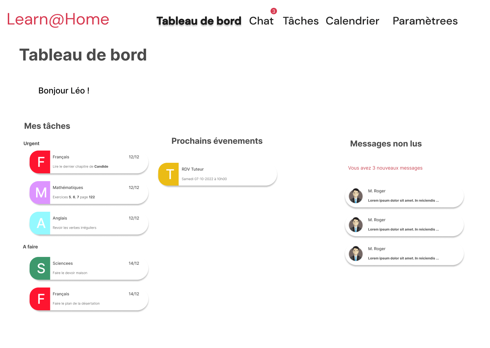

| Choose Your Language | Choisissez Votre Langue |
| -------------------- | ----------------------- |
|   |  |
|[English](#english)      | [Français](#français) |

___

|  | English version |
|:---:|:---:|

<h1 align="center">
    Learn@Home: Design and Development of an Educational Website
</h1>

## Table of Contents
1. [🌟 Introduction](#introduction-en)
2. [📜 Project Context](#context-en)
3. [🚀 Features](#features-en)
4. [💻 Technologies Used](#technologies-en)
5. [🎨 Mockups](#mockups-en)
6. [📈 Planning and Project Management](#planning-en)
7. [🎓 Affiliation with OpenClassrooms](#openclassrooms-en)
8. [👏 Acknowledgements](#thanks-en)
9. [✍️ Author](#author-en)
10. [©️ License](#licence-en)

## 🌟 Introduction 
Welcome to the Learn@Home project, an initiative aimed at connecting children struggling academically with volunteer tutors. As the lead web developer at Dev4U, my role was to conceptualize and coordinate the development of their educational platform.

## 📜 Project Context 
Learn@Home, an organization dedicated to remote academic support, entrusted Dev4U with the task of creating a website to facilitate communication between students and tutors. The project involved designing use case diagrams, user stories, mockups, and a Kanban for the main features.

## 🚀 Features 
- Development of an interface for login, chat, calendar, and task management.
- Design of mockups for both desktop and mobile versions.
- Creation of a Kanban for project planning.

## 💻 Technologies Used 

The Learn@Home project was developed using a variety of tools and technologies, each playing a crucial role in the design and management of the project. Here's a detailed overview of these key elements:

| Technology | Description |
| ----------- | ----------- |
|  | [**Figma**](https://www.figma.com/) for interactive mockup design and prototype creation. |
|  | [**Sketch**](https://www.sketch.com) used for graphic design and user interface creation. |
|  | [**Notion**](https://www.notion.so/) for Kanban-based project management and documentation. |
|  | [**Trello**](https://trello.com/) as an alternative to Notion for project management. |
|  | [**GitHub**](https://github.com/) for code versioning and collaboration. |
|  | [**Microsoft Word**](https://www.microsoft.com/fr-fr/microsoft-365/word) for document and report writing. |
|  | [**PDF**](https://www.adobe.com/fr/acrobat/about-adobe-pdf.html) for creating shareable documents. |
|  | [**Microsoft Excel**](https://www.microsoft.com/fr-fr/microsoft-365/excel) for data management and complex table creation. |

_These tools and technologies were chosen for their effectiveness and relevance in creating an interactive educational platform, combining graphic design, project management, and documentation._

## 🎨 Mockups 
Mockups for the site were created using Figma for a simple and effective design, meeting the communication needs between students and tutors. [View the mockups](https://www.figma.com/community/file/1284190817625405376)

## 📈 Planning and Project Management 
The project was planned and managed using a Kanban approach, ensuring a structured and agile methodology for software development.

## 🎓 Affiliation with OpenClassrooms 
This project was carried out in affiliation with OpenClassrooms, reflecting the application of skills acquired in my web development training.

## 👏 Acknowledgements 
A big thank you to the entire Learn@Home team for their trust, as well as to Dev4U for their support in realizing this significant educational project.

## ✍️ Author 
Developed by me, Mohamed Ali EL HAMECH, a passionate web developer dedicated to creating digital solutions that make a positive impact.

- 📧 **Email:** [master.code.develop@gmail.com](mailto:master.code.develop@gmail.com)
- 🔗 **LinkedIn:** [EL HAMECH Mohamed Ali](https://www.linkedin.com/in/master-dev/)
- 💼 **Portfolio:** [www.elhamech-mohamedali.com](https://www.elhamech-mohamedali.com)

## ©️ License 
This project is intended for personal and educational use. All rights reserved.

[Back to Top](#top)

___

|  | Version française |
|:---:|:---:|

<h1 align="center">
    Learn@Home : Conception et Développement d'un Site Web Éducatif
</h1>

## Sommaire
1. [🌟 Introduction](#introduction-fr)
2. [📜 Contexte du Projet](#context-fr)
3. [🚀 Fonctionnalités](#features-fr)
4. [💻 Technologies Utilisées](#technologies-fr)
5. [🎨 Maquettes](#mockups-fr)
6. [📈 Planification et Gestion de Projet](#planning-fr)
7. [🎓 Affiliation à OpenClassrooms](#openclassrooms-fr)
8. [👏 Remerciements](#thanks-fr)
9. [✍️ Auteur](#author-fr)
10. [©️ Licence](#licence-fr)

## 🌟 Introduction 
Bienvenue sur le projet Learn@Home, une initiative visant à connecter des enfants en difficulté scolaire avec des tuteurs bénévoles. Mon rôle en tant que lead développeur web chez Dev4U a été de conceptualiser et coordonner le développement de leur plateforme éducative.

## 📜 Contexte du Projet 
Learn@Home, une association dédiée au soutien scolaire à distance, a confié à Dev4U la tâche de créer un site web facilitant la communication entre élèves et tuteurs. Le projet impliquait la conception de diagrammes de cas d'usage, de user stories, de maquettes et d'un Kanban pour les principales fonctionnalités.

## 🚀 Fonctionnalités 
- Développement d'une interface pour la connexion, le chat, le calendrier et la gestion des tâches.
- Conception de maquettes pour les versions desktop et mobile.
- Création d'un Kanban pour la planification du projet.

## 💻 Technologies Utilisées 

Le projet Learn@Home a été élaboré avec une variété d'outils et de technologies, chacun jouant un rôle crucial dans la conception et la gestion du projet. Voici une présentation détaillée de ces éléments :

| Technologie | Description |
| ----------- | ----------- |
|  | [**Figma**](https://www.figma.com/) pour la conception de maquettes interactives et la création de prototypes. |
|  | [**Sketch**](https://www.sketch.com) utilisé pour le design graphique et les interfaces utilisateur. |
|  | [**Notion**](https://www.notion.so/) pour la gestion de projet en Kanban et la documentation. |
|  | [**Trello**](https://trello.com/) comme alternative à Notion pour la gestion de projet. |
|  | [**GitHub**](https://github.com/) pour le versioning et la collaboration sur le code. |
|  | [**Microsoft Word**](https://www.microsoft.com/fr-fr/microsoft-365/word) pour la rédaction de documents et de rapports. |
|  | [**PDF**](https://www.adobe.com/fr/acrobat/about-adobe-pdf.html) pour la création de documents partageables. |
|  | [**Microsoft Excel**](https://www.microsoft.com/fr-fr/microsoft-365/excel) pour la gestion de données et la création de tableaux complexes. |

_Ces outils et technologies ont été choisis pour leur efficacité et leur pertinence dans la création d'une plateforme éducative interactive, alliant conception graphique, gestion de projet et documentation._

## 🎨 Maquettes 
Les maquettes du site ont été créées en utilisant Figma pour un design simple et efficace, répondant aux besoins de communication entre élèves et tuteurs. [Voir les maquettes](https://www.figma.com/community/file/1284190817625405376)

## 📈 Planification et Gestion de Projet 
Le projet a été planifié et géré en utilisant un Kanban, assurant une approche structurée et agile du développement logiciel.

## 🎓 Affiliation à OpenClassrooms 
Ce projet a été réalisé en affiliation avec OpenClassrooms, reflétant l'application des compétences acquises dans ma formation en développement web.

## 👏 Remerciements 
Un grand merci à toute l'équipe de Learn@Home pour leur confiance, ainsi qu'à Dev4U pour leur soutien dans la réalisation de ce projet éducatif significatif.

## ✍️ Auteur 
Développé par moi, Mohamed ALi EL HAMECH, lead développeur web passionné par la création de solutions numériques qui ont un impact positif.

- 📧 **E-mail :** [master.code.develop@gmail.com](mailto:master.code.develop@gmail.com)
- 🔗 **LinkedIn :** [EL HAMECH Mohamed Ali](https://www.linkedin.com/in/master-dev/)
- 💼 **Portfolio :** [www.elhamech-mohamedali.com](https://www.elhamech-mohamedali.com)

## ©️ Licence 
Ce projet est destiné à un usage personnel et éducatif. Tous droits réservés.

[Retour en haut](#top)
