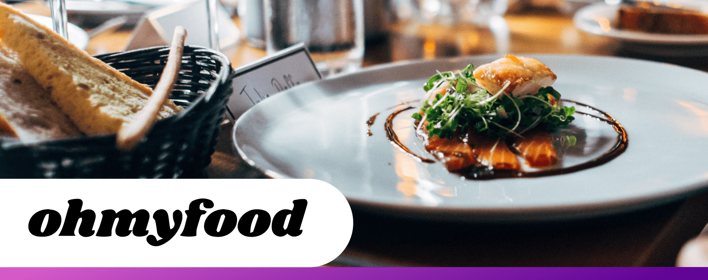

| Choose Your Language | Choisissez Votre Langue |
| -------------------- | ----------------------- |
|   |  |
|[English](#english)      | [Français](#français) |

___

|  | This is the English version |
|:---:|:---:|

<h1 align="center">
    Ohmyfood: Revolutionizing Parisian Dining with OpenClassrooms
</h1>

### Table of Contents
1. [🌟 Introduction](#introduction-en)
2. [🌍 See the Site in Action](#demo-en)
3. [🎓 Affiliation with OpenClassrooms](#openclassrooms-en)
4. [📜 Project Context](#context-en)
5. [🚀 Features](#features-en)
6. [💻 Technologies Used](#technologies-en)
7. [🔍 Specifications](#specifications-en)
8. [🎨 Mockups](#mockups-en)
9. [📁 Project Structure](#structure-en)
10. [📈 Impact and Improvements](#impact-en)
11. [🤝 Contributing](#contribute-en)
12. [👏 Acknowledgements](#thanks-en)
13. [✍️ Contact](#contact-en)
14. [©️ License](#license-en)

## 🌟 Introduction
Welcome to the Ohmyfood project, a Parisian startup initiative aimed at revolutionizing dining with the option to pre-order gourmet menus. This project is undertaken in partnership with OpenClassrooms.

## 🌍 See the Site in Action
Experience the intuitive and engaging user interface of the Ohmyfood site online. Discover the site here: [Ohmyfood in Action](https://ohmyfood-master.netlify.app)

## 🎓 Affiliation with OpenClassrooms
This project is a result of my web development training at OpenClassrooms, blending theoretical learning with practical application.

## 📜 Project Context
Ohmyfood aims to become a major player in Parisian dining by offering a platform for booking gourmet menus for a unique culinary experience.

## 🚀 Features
- Advanced menu reservation
- Customization of culinary choices
- Optimized interface for mobiles and tablets

## 💻 Technologies Used
Here are the main technologies and tools used for the development of the project:

| Technology | Description |
| ----------- | ----------- |
|  | **[HTML5](https://developer.mozilla.org/en-US/docs/Web/Guide/HTML/HTML5)** for building the site's basic structure. |
|  | **[CSS3](https://developer.mozilla.org/en-US/docs/Web/CSS)** for styling and formatting. |
|  | **[JavaScript](https://developer.mozilla.org/en-US/docs/Web/JavaScript)** for interactive and dynamic features. |
|  | **[SCSS](https://sass-lang.com)** for more advanced and modular CSS style management. |
|  | **[FontAwesome](https://fontawesome.com)** for attractive and customizable web icons. |
|  | **[Google Fonts](https://fonts.google.com)** for a variety of elegant and easily integrated web fonts. |
|  | **[Figma](https://www.figma.com)** for designing and prototyping the site's mockups. |
|  | **[Visual Studio Code](https://code.visualstudio.com)** for efficient development with multiple supported extensions. |

_These technologies were chosen for their efficiency, ease of use, and ability to create an optimal user experience._

## 🔍 Specifications
- Responsive development in accordance with provided mockups
- Integration of CSS animations for a dynamic interface
- Compliance with web standards and best development practices

## 🎨 Mockups
View the detailed design and structure plans for the site in the mockups available on [Figma](https://www.figma.com/file/t4449fzDnwGYmzuwQdu87V).

## 📁 Project Structure
The project structure is organized for easy maintenance and scalability, clearly separating different aspects of development (HTML/CSS, JavaScript, resources).

## 📈 Impact and Improvements
Optimizations have enhanced user experience, reduced loading times, and increased user engagement.

## 🤝 Contributing
I am open to collaboration or suggestions to improve this project. Feel free to contact me to contribute.

## 👏 Acknowledgements
Special thanks to the OpenClassrooms team and all partners involved in this project for their support and valuable advice.

## ✍️ Contact
If you wish to learn more about this project, discuss potential collaborations, or simply share ideas and suggestions, I am available to talk with you. Please contact me at the following details:

(Same contact details as in the French version)

Your interest and engagement are highly appreciated, and I look forward to the possibility of collaborating with you!

## ©️ License
This project is developed as part of my training with OpenClassrooms and is subject to copyright. Any unauthorized use is prohibited.

[Back to Top](#top)

___

|  | Ce-ci est la version française |
|:---:|:---:|

<h1 align="center">
    Ohmyfood: Révolutionner la Restauration à Paris avec OpenClassrooms
</h1>

### Sommaire
1. [🌟 Introduction](#introduction-fr)
2. [🌍 Voir le Site en Action](#demo-fr)
3. [🎓 Affiliation à OpenClassrooms](#openclassrooms-fr)
4. [📜 Contexte du Projet](#context-fr)
5. [🚀 Fonctionnalités](#features-fr)
6. [💻 Technologies Utilisées](#technologies-fr)
7. [🔍 Cahier des Charges](#specifications-fr)
8. [🎨 Maquettes](#models-fr)
9. [📁 Structure du Projet](#structure-fr)
10. [📈 Impact et Améliorations](#impact-fr)
11. [🤝 Contribuer](#contribute-fr)
12. [👏 Remerciements](#thanks-fr)
13. [✍️ Contact](#contact-fr)
14. [©️ Licence](#licence-fr)

## 🌟 Introduction
Bienvenue sur le projet Ohmyfood, une initiative de la startup parisienne visant à révolutionner la restauration avec la possibilité de commander à l'avance des menus gastronomiques. Ce projet est réalisé en partenariat avec OpenClassrooms.

## 🌍 Voir le Site en Action
Le site Ohmyfood est accessible en ligne, offrant une expérience utilisateur intuitive et engageante. Découvrez le site ici : [Ohmyfood en Action](https://ohmyfood-master.netlify.app)

## 🎓 Affiliation à OpenClassrooms
Ce projet est le résultat de ma formation en développement web chez OpenClassrooms, combinant apprentissage théorique et application pratique.

## 📜 Contexte du Projet
Ohmyfood ambitionne de devenir un acteur majeur de la restauration parisienne, en offrant une plateforme de réservation de menus gastronomiques pour une expérience culinaire unique.

## 🚀 Fonctionnalités
- Réservation anticipée de menus
- Personnalisation des choix culinaires
- Interface optimisée pour mobiles et tablettes

## 💻 Technologies Utilisées

Voici les principales technologies et outils utilisés pour le développement du projet :

| Technologie | Description |
| ----------- | ----------- |
|  | **[HTML5](https://developer.mozilla.org/en-US/docs/Web/Guide/HTML/HTML5)** pour la construction de la structure de base du site. |
|  | **[CSS3](https://developer.mozilla.org/en-US/docs/Web/CSS)** pour le style et la mise en forme. |
|  | **[JavaScript](https://developer.mozilla.org/en-US/docs/Web/JavaScript)** pour les fonctionnalités interactives et dynamiques. |
|  | **[SCSS](https://sass-lang.com)** pour une gestion plus avancée et modulaire des styles CSS. |
|  | **[FontAwesome](https://fontawesome.com)** pour les icônes web attractives et personnalisables. |
|  | **[Google Fonts](https://fonts.google.com)** pour une variété de polices web élégantes et facilement intégrables. |
|  | **[Figma](https://www.figma.com)** pour la conception et le prototypage des maquettes du site. |
|  | **[Visual Studio Code](https://code.visualstudio.com)** pour un développement efficace avec de multiples extensions supportées. |

_Ces technologies ont été choisies pour leur efficacité, leur facilité d'utilisation et leur capacité à créer une expérience utilisateur optimale._

## 🔍 Cahier des Charges
- Développement responsive en accord avec les maquettes fournies
- Intégration d'animations CSS pour une interface dynamique
- Respect des standards web et des bonnes pratiques de développement

## 🎨 Maquettes
Les maquettes du site, disponibles sur [Figma](https://www.figma.com/file/t4449fzDnwGYmzuwQdu87V), offrent un aperçu détaillé du design et de la structure envisagés pour le site.

## 📁 Structure du Projet
La structure du projet est organisée pour une maintenance et une évolutivité aisées, en séparant clairement les différents aspects du développement (HTML/CSS, JavaScript, ressources).

## 📈 Impact et Améliorations
Les optimisations apportées ont amélioré l'expérience utilisateur, réduit les temps de chargement et augmenté l'engagement des utilisateurs.

## 🤝 Contribuer
Je suis ouvert à toute collaboration ou suggestion pour améliorer ce projet. N'hésitez pas à me contacter pour apporter votre contribution.

## 👏 Remerciements
Un grand merci à l'équipe d'OpenClassrooms et à tous les partenaires impliqués dans ce projet pour leur soutien et leurs conseils précieux.

## ✍️ Contact
Si vous souhaitez en savoir plus sur ce projet, discuter de potentielles collaborations ou simplement partager vos idées et suggestions, je suis disponible pour échanger avec vous. Vous pouvez me contacter aux coordonnées suivantes :

- 📧 **E-mail :** Pour toute demande d'information, proposition de projet ou question générale, n'hésitez pas à m'envoyer un e-mail à [master.code.develop@gmail.com](mailto:master.code.develop@gmail.com).

- 🔗 **LinkedIn :** Pour des mises en réseau professionnelles, des opportunités de carrière ou pour suivre mes dernières actualités professionnelles, connectez-vous avec moi sur [LinkedIn](https://www.linkedin.com/in/master-dev/).

- 💼 **Portfolio :** Découvrez mes autres projets, mon parcours et mes compétences en détail sur mon portfolio en ligne à l'adresse [www.elhamech-mohamedali.com](https://www.elhamech-mohamedali.com).

Votre intérêt et votre engagement sont très appréciés, et je me réjouis à l'idée de pouvoir collaborer avec vous !

## ©️ Licence
Ce projet est développé dans le cadre de ma formation avec OpenClassrooms et est soumis à des droits d'auteur. Toute utilisation non autorisée est interdite.

[Retour en haut](#top)